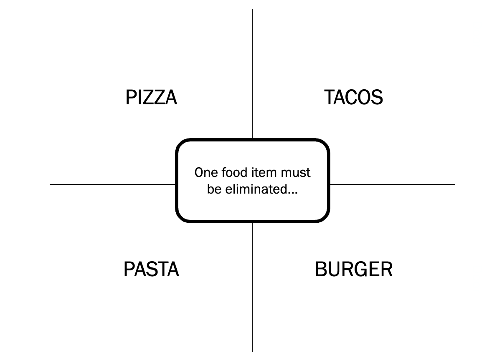

# Brain Breaks

## 4 (Best) Corners

Figure 1. Eliminate one food group.

Figure 2. How would a dog wear pants?

## Charty Party

Similar to Apples to Apples or Cards Against Humanity​

- Distribute 7 orange "y-axis" cards to each player​

- Pick a "judge" for the round​

- Judge displays one white "chart" card and ​describes what is happening
  in the chart​

- Each player (but the judge) chooses ONE orange card from their hand to
  play, placing it face down by the white card in the center​

- The judge then picks their favorite orange card and the round resets
  with that player as the new judge​

- Players may pick up new orange cards to total 7​

## 10 Similarities

Students work in teams to find 10 things they have in common.

- Divide your team into groups of 2-5 people.

- Teams will have a set amount of time to identify 10 things everyone
  shares.

  - No limits to scope, it can be personal, work related, or cultural.

  - Must ask each other questions.

  - Teams can not do negatives.

- When the time is up, teams can come back together and share out the
  most interesting thing they have in common.

## What cute animal are you today?

Figure 3. What cute animal are you today?

Last updated 2026-09-18 19:29:40 UTC
